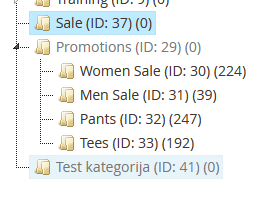

# MB_AdminCategoryStyle

## Srpski

`MB_AdminCategoryStyle` je mali Magento 2 modul koji olakšava vizuelno razlikovanje aktivnih i neaktivnih kategorija u Admin panelu.

Na stranici **Catalog > Categories**:

- aktivne kategorije zadržavaju originalni Magento izgled;
- neaktivne kategorije dobijaju svetliju boju fonta (`#777`);
- klik, izmena, proširivanje stabla i prevlačenje kategorija ostaju nepromenjeni.

Modul koristi postojeću Magento CSS klasu `not-active-category`. Ne menja Magento core, podatke kategorija niti ponašanje prodavnice. Nema JavaScript, bazne tabele, cron poslove ni Admin konfiguraciju.

### Testirano na staging okruženju

Modul je funkcionalno testiran na Magento staging okruženju. Neaktivne kategorije prikazane su svetlijim fontom, dok aktivne kategorije zadržavaju originalni izgled.



### Kompatibilnost

- Magento Open Source 2.4.5+
- Adobe Commerce 2.4.5+
- Nije povezan sa storefront temom; radi u Magento Admin oblasti i ne zahteva Hyvä compatibility modul.

Navedena kompatibilnost je zasnovana na strukturi Magento Category tree-a. Pre produkcije proverite izgled u vašoj konkretnoj Magento verziji i Admin temi.

### Instalacija u `app/code`

Kopirajte sadržaj repozitorijuma u:

```text
app/code/MB/AdminCategoryStyle
```

Zatim, iz Magento root direktorijuma, pokrenite:

```bash
bin/magento module:enable MB_AdminCategoryStyle
bin/magento setup:upgrade
bin/magento cache:clean layout block_html
```

U production modu ponovo generišite Admin static content prema vašem deployment procesu, na primer:

```bash
bin/magento setup:static-content:deploy -f
```

### Composer instalacija

Ako je privatni repozitorijum dodat kao Composer VCS repository:

```bash
composer require mb/module-admin-category-style
bin/magento module:enable MB_AdminCategoryStyle
bin/magento setup:upgrade
bin/magento cache:clean layout block_html
```

### Podešavanje boje

Boja se nalazi u fajlu:

```text
view/adminhtml/web/css/category-tree.css
```

Podrazumevana vrednost je `#777`. Aktivne kategorije nemaju dodatno CSS pravilo i zato ostaju nepromenjene.

### Uklanjanje

```bash
bin/magento module:disable MB_AdminCategoryStyle
bin/magento setup:upgrade
bin/magento cache:clean layout block_html
```

Nakon toga uklonite direktorijum modula ili Composer paket.

---

## English

`MB_AdminCategoryStyle` is a small Magento 2 module that makes active and inactive categories easier to distinguish in the Admin panel.

On **Catalog > Categories**:

- active categories retain Magento's original appearance;
- inactive categories use a lighter font color (`#777`);
- clicking, editing, expanding the tree, and dragging categories remain unchanged.

The module uses Magento's existing `not-active-category` CSS class. It does not modify Magento core, category data, or storefront behavior. It contains no JavaScript, database tables, cron jobs, or Admin configuration.

### Staging test

The module has been functionally tested in a Magento staging environment. Inactive categories are displayed with a lighter font color, while active categories retain their original appearance.


### Compatibility

- Magento Open Source 2.4.5+
- Adobe Commerce 2.4.5+
- Storefront-theme independent; it runs in the Magento Admin area and does not require a Hyvä compatibility module.

Compatibility is based on the Magento Category tree structure. Verify the visual result with your exact Magento version and Admin theme before production deployment.

### `app/code` installation

Copy the repository contents to:

```text
app/code/MB/AdminCategoryStyle
```

Then run the following commands from the Magento root directory:

```bash
bin/magento module:enable MB_AdminCategoryStyle
bin/magento setup:upgrade
bin/magento cache:clean layout block_html
```

In production mode, regenerate Admin static content according to your deployment process, for example:

```bash
bin/magento setup:static-content:deploy -f
```

### Composer installation

After adding the private repository as a Composer VCS repository:

```bash
composer require mb/module-admin-category-style
bin/magento module:enable MB_AdminCategoryStyle
bin/magento setup:upgrade
bin/magento cache:clean layout block_html
```

### Changing the color

The color is defined in:

```text
view/adminhtml/web/css/category-tree.css
```

The default value is `#777`. No additional CSS rule is applied to active categories, so their original appearance is preserved.

### Uninstallation

```bash
bin/magento module:disable MB_AdminCategoryStyle
bin/magento setup:upgrade
bin/magento cache:clean layout block_html
```

Then remove the module directory or Composer package.

## License

Proprietary. Private use only. See [LICENSE](LICENSE).
